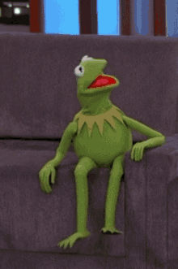
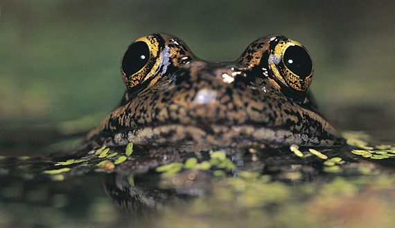
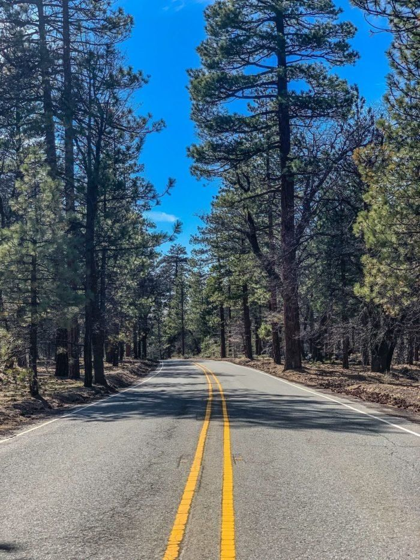
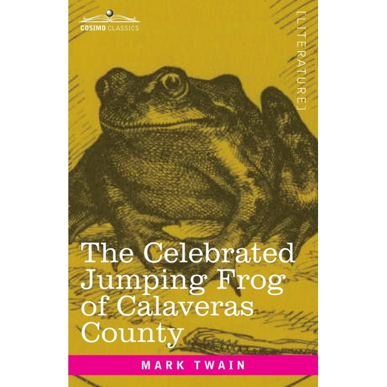

```{r setup, include=FALSE}
options(scipen = 1, digits = 2) #changes outputs to to decimal places.
knitr::opts_chunk$set(echo = TRUE)
packages_needed <- c("ggplot2", # graphics
                     "arm", # display() etc.
                     "ggfortify", # check model assumptions
                     "AICcmodavg", #average AIC models
                     "grid" #arrange objects
                     )
pk_to_install <- packages_needed [!( packages_needed %in% rownames(installed.packages())  )]
if(length(pk_to_install)>0 ){
  install.packages(pk_to_install,repos="http://cran.r-project.org")
}
#lapply(packages_needed, require, character.only = TRUE)
library(ggplot2)
library(arm)
library(ggfortify)
library(AICcmodavg)
library(grid)
library(tidyverse)
```

## Don't You Froget About Me

Why are frogs so bad at data analysis?

Because they jump to conclusions.



```{r Video, echo=FALSE, message=FALSE, warning=FALSE}
library(vembedr)
embed_youtube("9571clQoONE")
```

This analysis was conducted using previously collected data on the California red-legged frog, which is California's largest native frog. It is listed as federally threatened, in a large part due to habitat loss and introduction of the invasive American Bullfrog (who's presence/absence was also recorded in this data set).

[Link to the data source](https://datadryad.org/stash/dataset/doi:10.5061/dryad.hc8qs61)



```{r Frogs, message=FALSE, warning=FALSE, include=FALSE}
library(readr)
frogs <- read_csv("Anderson_PLOS_data.csv")
frogs_filtered<-na.omit(frogs)
glimpse(frogs_filtered)
```

## Choosing My Data

.jpg)



I chose to use the distance from a paved road as the variable I weighed against California red-legged frog presence/absence. They also looked at a wide variety of other variables like distance from dirt roads and hiking trails as well as some vegetation, food and water variables.

```{r data frame, echo=FALSE, message=FALSE, warning=FALSE}
glimpse(frogs_filtered)
```

## Binomial Plotting

Here is the plot for my chosen variables.

```{r filtering, echo=FALSE, message=FALSE, warning=FALSE}
ggplot(frogs_filtered, aes(PavedRoadDistance, CRLF)) +
  geom_point(size=3) +
  geom_smooth(method="glm", method.args=list(family="binomial"(link="logit"))) +
  labs(title="Presence/Absence of California Red-legged Frog)") +
  ylab ("Probability of Occurrence") +
  xlab ("Distance to Paved Road (m)")
```

My initial model looking at my chosen variables.

```{r Model, echo=FALSE, message=FALSE, warning=FALSE}
model_frog <- glm(CRLF ~ PavedRoadDistance, data=frogs_filtered, family=binomial)
model_frog
```

Here is my overdispersion check, like in our spider example. It looks a bit different, but I think most are still within the lines.

```{r check for overdispersion, echo=FALSE, message=FALSE, warning=FALSE}
library(arm)
x <- predict(model_frog)
y <- resid(model_frog)
binnedplot(x, y)
```

## Looking at the Model

```{r Frog model coefficients, echo=FALSE, message=FALSE, warning=FALSE}
coef(model_frog)
```

```{r Frog model confidence intervals, echo=FALSE, message=FALSE, warning=FALSE}
confint(model_frog)
```

The slope of distance variable is 0.002. After using the divide by 4 rule, the distance of 1 meter from a paved road corresponds to a increase in the probability of CRLF presence of 0.5% since 0.002/4 = 0.005. The scale of paved road distance is 0.005 to 0.001. m

```{r model summary, echo=FALSE, message=FALSE, warning=FALSE}
summary(model_frog)
```

In the model summary, the deviances are fairly similar, but there is no significant interaction between paved road distance and frog presence.

Fun Fact:

This is the frog that was referenced in Mark Twain's short story "The Celebrates Jumping Frog of Calavera's County"


